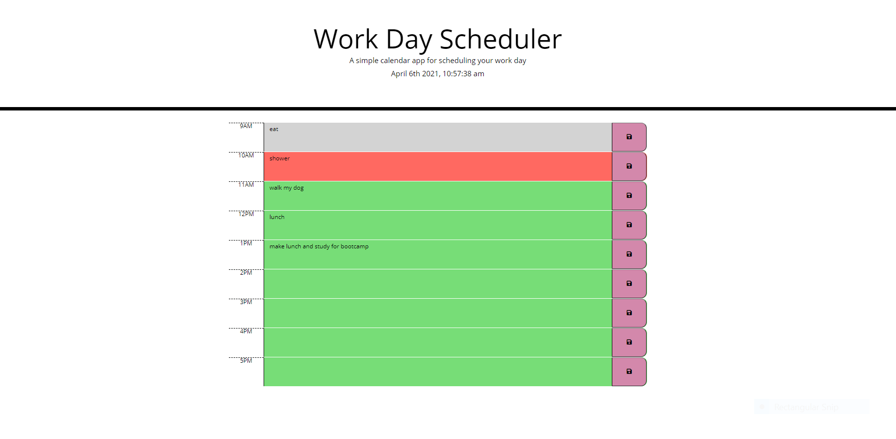

# 05 Third-Party APIs: Work Day Scheduler

## My Task

For the fifth homework assignment in week five of UNH Full-Stack Coding BootcampCreate I modified starter code to create a simple calendar application that allows a user to save events for each hour of the day. 

## User Story

AS AN employee with a busy schedule
I WANT to add important events to a daily planner
SO THAT I can manage my time effectively

## Description

When the user opens the planner the current day and time is displayed at the top of the page. The user is then presented with time-blocks with standard business hours 9am - 5pm, an hour in each row. The time-blocks are color coded, grey for past, green for present, and red for future events. The user is able to click into the text area, write their task for the hour and click the save button to save their task to the page and to local storage.

## Built with

* HTML
* CSS
* JavaScript
* jQuery
* Bootstrap
* Moment js

## Powered by 

* Jquery

## Links

* [GitHub Repository](https://github.com/efagioli01/Work-Day-Scheduler-Code-Refactor)
* [Deployed Application](https://efagioli01.github.io/Work-Day-Scheduler-Code-Refactor/)

## Screenshot 
 
 
 
 ## LICENSE

 MIT License

Copyright (c) [2021] [Erica Fagioli] 

Permission is hereby granted, free of charge, to any person obtaining a copy of this software and associated documentation files (the "Software"), to deal in the Software without restriction, including without limitation the rights to use, copy, modify, merge, publish, distribute, sublicense, and/or sell copies of the Software, and to permit persons to whom the Software is furnished to do so, subject to the following conditions:

The above copyright notice and this permission notice shall be included in all copies or substantial portions of the Software.

THE SOFTWARE IS PROVIDED "AS IS", WITHOUT WARRANTY OF ANY KIND, EXPRESS OR IMPLIED, INCLUDING BUT NOT LIMITED TO THE WARRANTIES OF MERCHANTABILITY, FITNESS FOR A PARTICULAR PURPOSE AND NONINFRINGEMENT. IN NO EVENT SHALL THE AUTHORS OR COPYRIGHT HOLDERS BE LIABLE FOR ANY CLAIM, DAMAGES OR OTHER LIABILITY, WHETHER IN AN ACTION OF CONTRACT, TORT OR OTHERWISE, ARISING FROM, OUT OF OR IN CONNECTION WITH THE SOFTWARE OR THE USE OR OTHER DEALINGS IN THE SOFTWARE.
 
 

